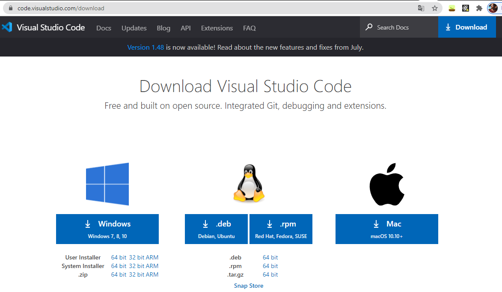
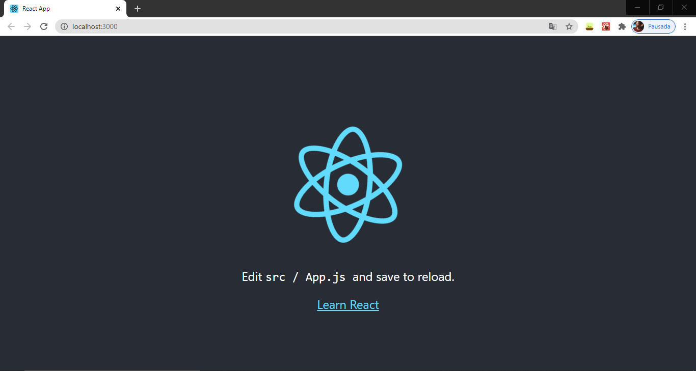
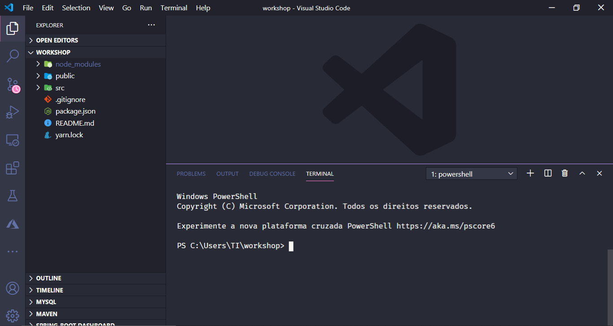

# workshop-react-consuming-api

## O que é React?

O React é uma biblioteca JavaScript de código aberto com foco em criar interfaces de usuário em páginas web. É mantido pelo Facebook, Instagram, outras empresas e uma comunidade de desenvolvedores individuais. É utilizado nos sites da Netflix, Imgur, Feedly, Airbnb, SeatGeek, HelloSign, Walmart e outros. Se preferir [clique aqui](https://www.youtube.com/watch?v=cEczlv669Oo) para assistir a um video e ter mais informações sobre React. 


Aqui está o link do repositório do projeto: [https://github.com/facebook/react](https://github.com/facebook/react).

## Preparação do ambiente

A primeira coisa que precisamos fazer antes de iniciar nosso projeto é garantir que temos o [NodeJs](https://nodejs.org/en/download/) instalado em nosso sistema**.** Para isto, abra um terminal **Ctrl + R** e digite `cmd` agora no seu prompt de comando digite `node -v` assim saberemos qual a versão do node instalada. Caso, retorne um erro significará que o NodeJs não está instalado, então [clique aqui](https://nodejs.org/en/download/) e baixe o NodeJs versão LTS, conforme seu sistema operacional e instale na sua máquina. Para instalar o Node é só dar next, next e finish. =\) 😉 Após a instalação concluída, repita a operação para verificar a versão.


Pronto! O NodeJs foi instalado com sucesso! 🥳 🎉 


O próximo passo é instalar a IDE para fazer o código do nosso projeto, caso não tenha instalado em sua máquina [clique aqui](https://code.visualstudio.com/download) para baixar o VSCode. 



Uma vez instalado o VSCode, vamos criar o nosso projeto. 

O NodeJs tem seu próprio gerenciador de dependências, ele nos permite instalar outros pacotes que iremos precisar no nosso projeto. O Yarn também é um gerenciador de dependências.

Primeiro, abra um prompt de comando, digite ou copie o comando abaixo:

```text
npm install -g yarn
```

Agora você pode conferir a versão do yarn digitando `yarn -v`


Vamos usar o comando a seguir para instalar o gerador de aplicativos do React. `yarn global add create-react-app`

Se quiser saber mais sobre o `create-react-app` pode conferir a documentação clicando [aqui](https://create-react-app.dev/).

## Criando o projeto 

Este comando irá criar o nosso projeto chamado **workshop**.

`create-react-app workshop`

Navegue para a pasta do projeto e inicie a aplicação.

`cd workshop && yarn start`



**Ctrl + C** para finalizar o processo. No diretório do projeto em que você acabou de criar digite `code .` para abrir o VSCode. 



## Instalação da biblioteca material UI

Instale a biblioteca de materiais do React chamada Material UI. Para isto abra o terminal dentro do VSCode apertando as teclas **Ctrl + Shift +  '**  do seu  ****teclado ou clicando no menu superior em **Terminal,** em seguida **New Terminal**. Copie o código abaixo e cole no terminal aberto e aperte **Enter.**

```text
yarn add @material-ui/core
```

Após isto, da mesma forma que realizou o passo anterior, instale o pacote [@material-ui/icons](https://www.npmjs.com/package/@material-ui/icons).

```text
yarn add @material-ui/icons
```

Instale também o framework [bootstrap](https://react-bootstrap.github.io/), com ele será mais fácil importar componentes para dentro do nosso projeto.

```text
yarn add react-bootstrap bootstrap
```

O React cria os arquivos e pastas que estaremos usando para modificar nosso projeto, e deixá-lo do jeito que nós queremos. Vá até a pasta **public** dentro dela está o nosso index.html. Dentro dele você vai encontrar dentro da tag body a`<div id="root"></div>` que é onde nossas alterações irão aparecer. Não apague essa div, do contrário terá problemas com a renderização do seu app.

Dentro da pasta **src** está o arquivo App.js 


Pronto!


[JSON](https://www.json.org/json-en.html) 

[https://jsonplaceholder.typicode.com/](https://jsonplaceholder.typicode.com/)


